# Inventario de Activos TI Pro

Sistema web empresarial para controlar activos tecnológicos, usuarios,
asignaciones, mantenimientos, garantías y auditoría.

## Diferencias por rol

### Administrador
- Dashboard completo.
- Gestión de usuarios.
- Creación y edición de activos.
- Cambio manual de estado.
- Asignaciones y devoluciones.
- Mantenimientos.
- Baja lógica y eliminación definitiva.
- Exportación CSV.
- Auditoría.

### Técnico
- Dashboard operativo.
- Creación y edición de activos.
- Cambio de estado.
- Asignaciones, devoluciones y mantenimiento.
- No administra usuarios ni elimina activos.

### Empleado
- Vista exclusiva de sus equipos.
- No ve el inventario de la empresa.
- No ve Swagger, reportes ni exportaciones.
- Consulta ficha, garantía e historial de sus activos.

## Instalación

```powershell
python -m venv .venv
Set-ExecutionPolicy -Scope Process -ExecutionPolicy Bypass
.venv\Scripts\activate
pip install -r requirements.txt
python -m uvicorn app.main:app --reload
```

Aplicación: `http://127.0.0.1:8000`

Swagger: `http://127.0.0.1:8000/docs`

## Usuarios demo

| Rol | Correo | Contraseña |
|---|---|---|
| Administrador | admin@demo.com | Admin123 |
| Técnico | tecnico@demo.com | Tecnico123 |
| Empleado | empleado@demo.com | Empleado123 |

## Pruebas

```powershell
python -m pytest -q --disable-warnings
```

## Tecnologías

Python, FastAPI, SQLModel, SQLite, Jinja2, Chart.js, Pytest, Docker y GitHub Actions.

# Capturas del proyecto

## Login

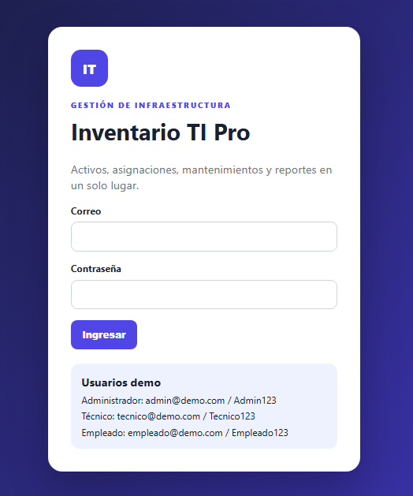

---

## Dashboard Administrador

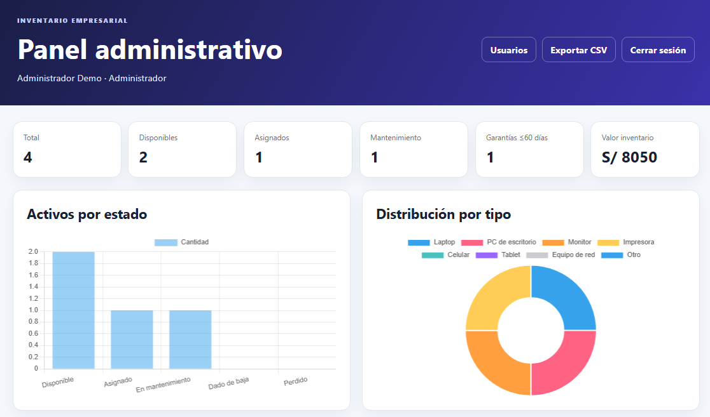

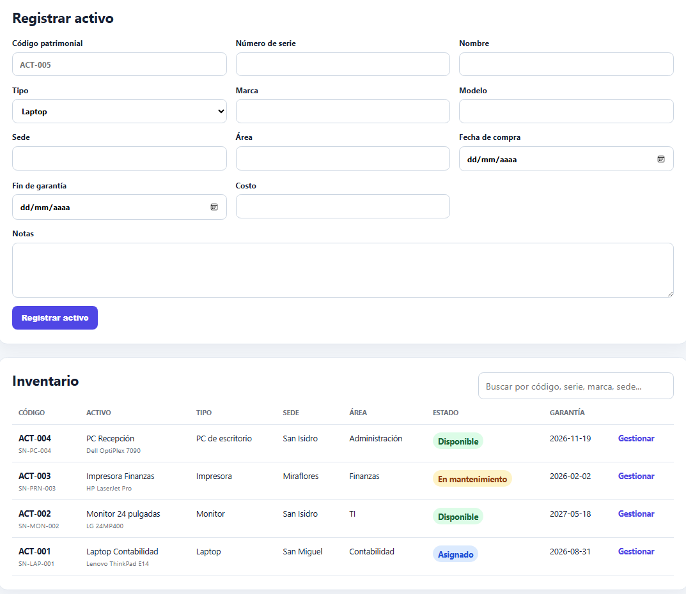

---

## Gestión de usuarios

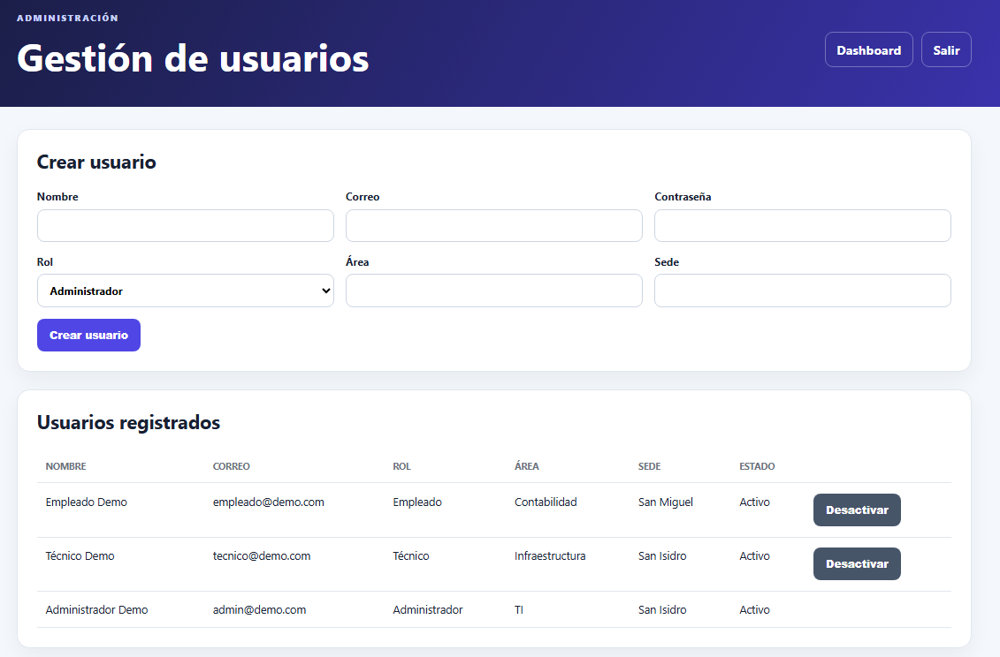

---

## Exportación de datos

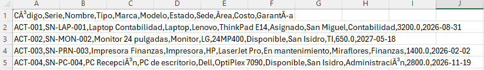

---

## Ficha de activo - Administrador

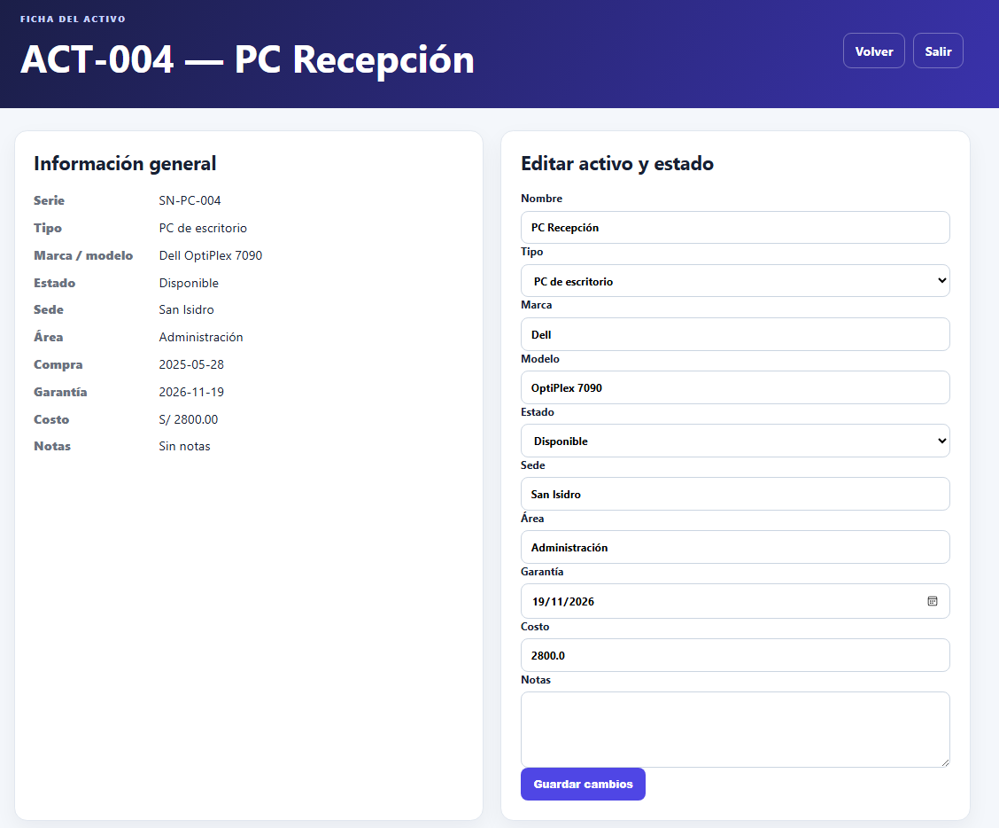

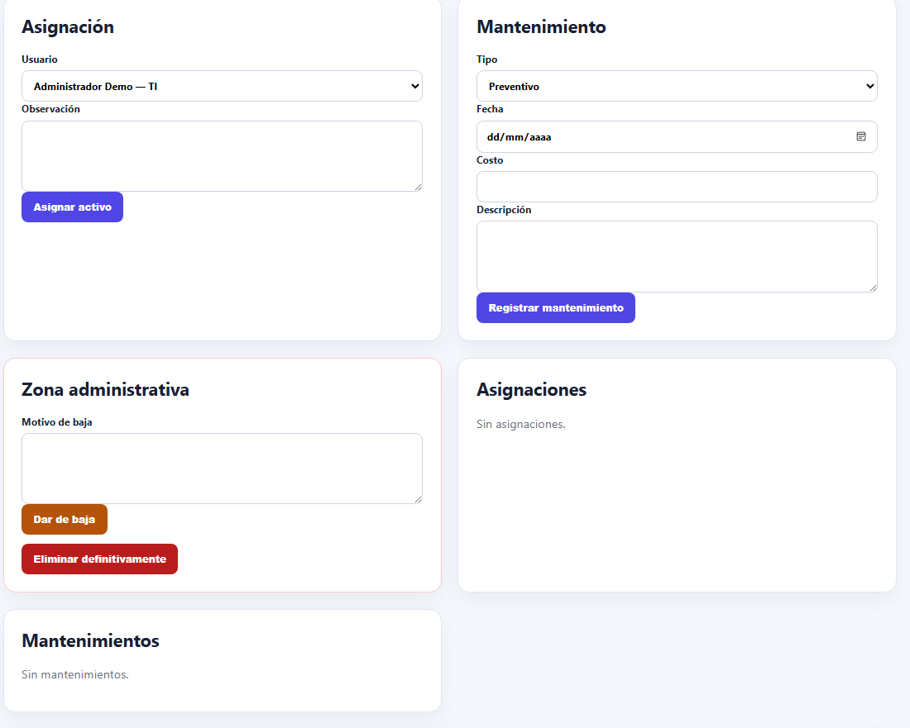

---

## Panel Técnico

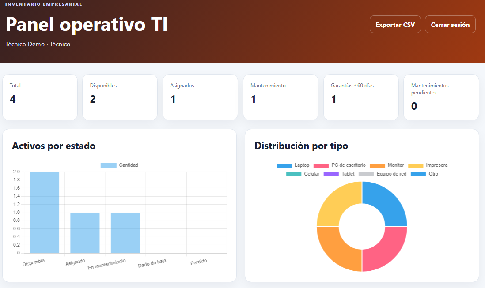

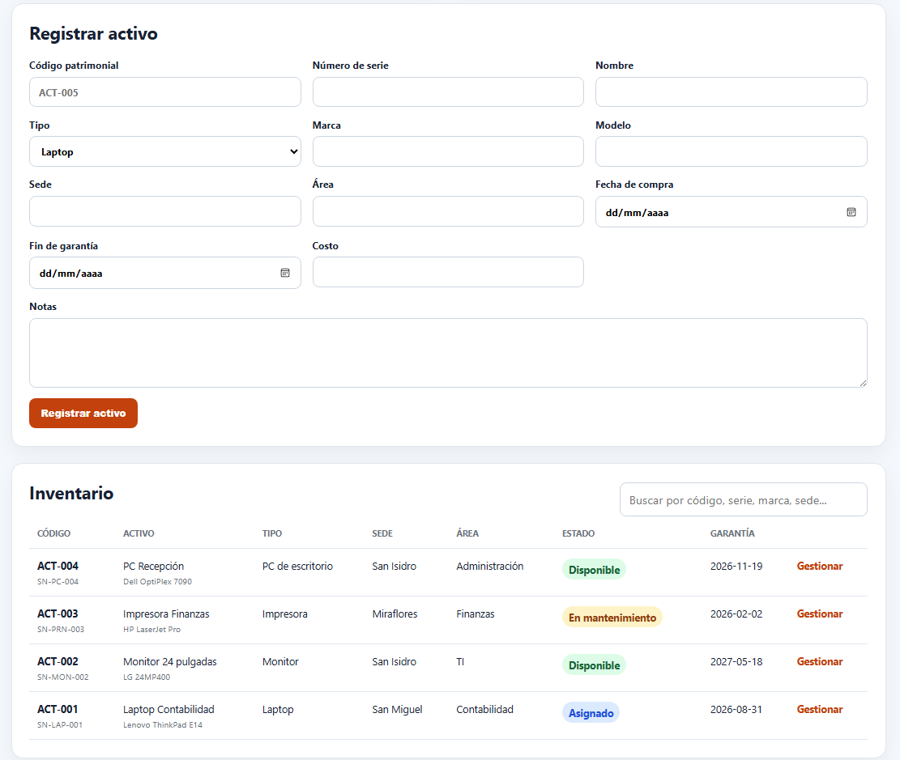

---

## Ficha de activo - Técnico


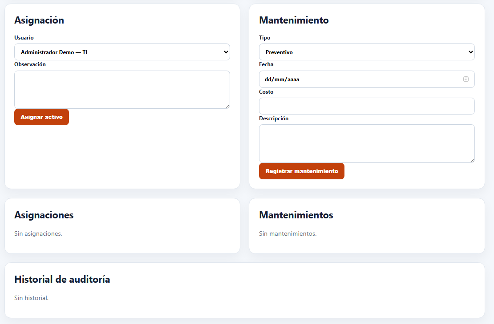

---

## Vista Empleado

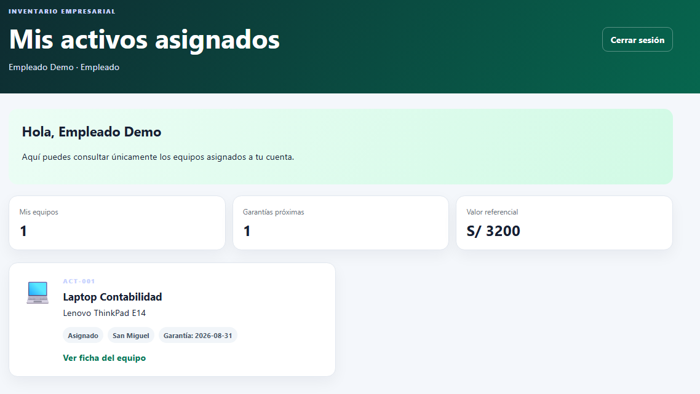

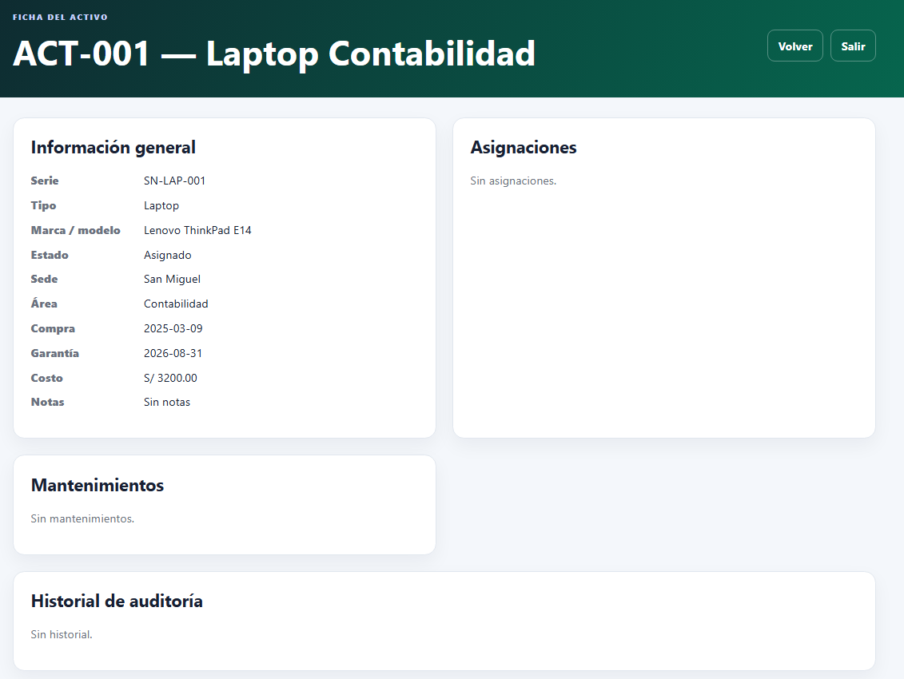

---

## Swagger

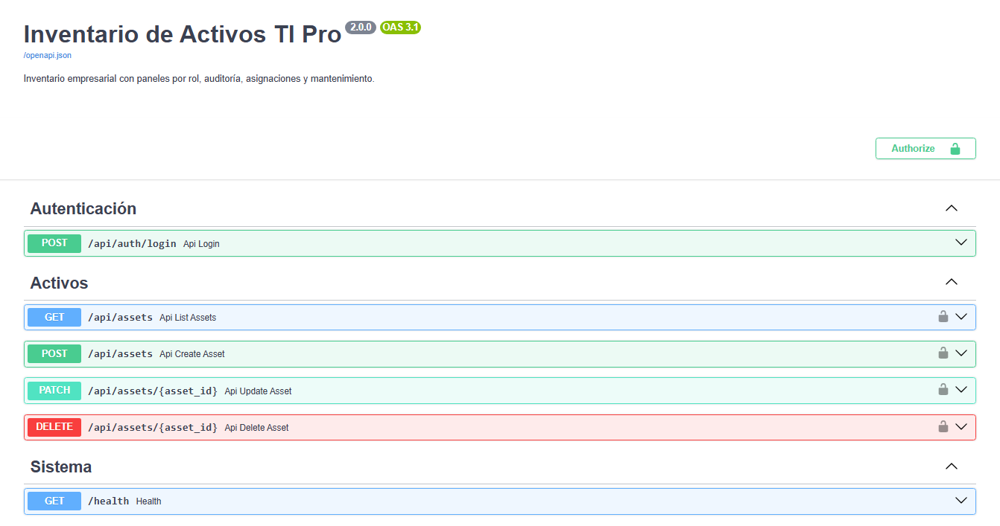

---

## Pruebas automatizadas

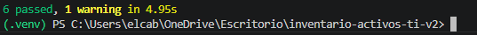